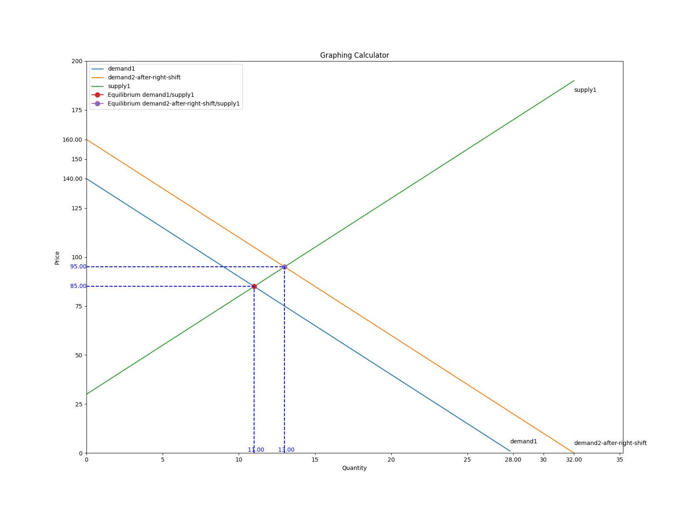
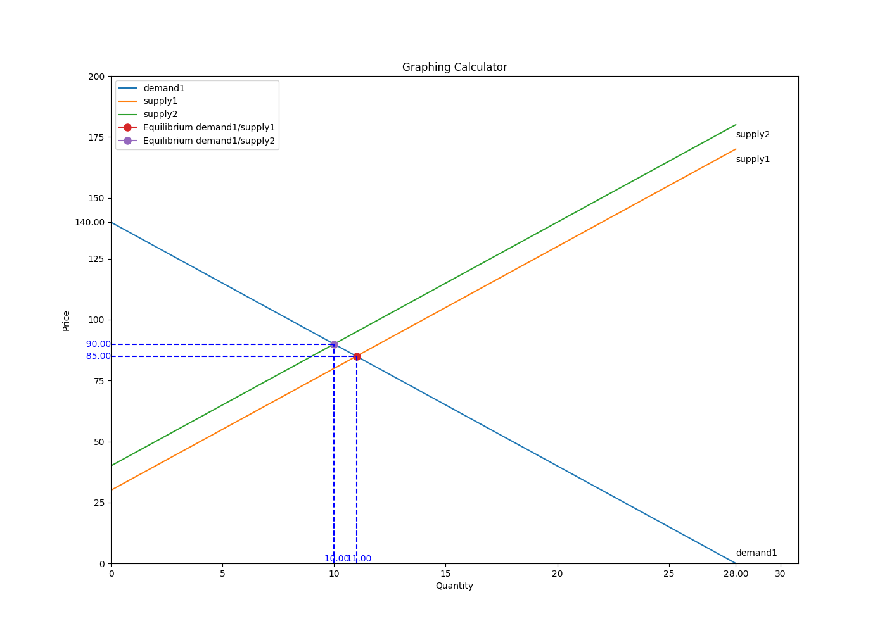
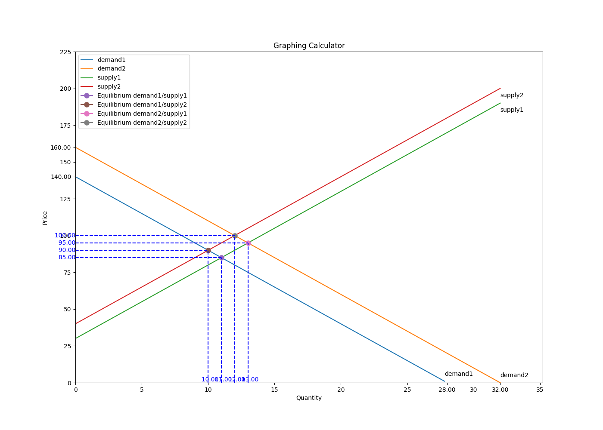

# Gies iMBA FIN574 Graphing Calculator

Graphing Calculator for the course

-   Free software: MIT license
-   Documentation:
    <https://gies-imba-fin574-graphing-calculator.readthedocs.io>.

## Features

-   Draw arbitrary number of supply and demand curves with automatic
    finding and labeling equilibrium.
-   Labeling intersection points on x and y axises for supply and demand
    curves.
-   X and Y axises are ticked with labels for easy reading.
-   Labels are after each curve ends.

## Installation

To install the package, you can clone the package and run the following
command:

`python3 setup.py install`

## Running the examples

Examples are stored under [examples]{.title-ref} folder. You can run
them by executing the following command:

`gies_imba_fin574_graphing_calculator examples/two_supply_demand_curves_definition.yaml`


This will run the two supply and one demand curve example. There are
multiple examples under the [examples]{.title-ref} folders that you can
test before setting up your own definition file.

Once confident, you can create your own definition file and replace the
name of the curves to the curve name that you have been assigned to in
the course. The curve equation, make to use multiplication sign. That
is, instead of writing a demand curve with [150-3x]{.title-ref}, write
it as [150-3\*X]{.title-ref}. This is a known limitation of this
package.

## Two Demand Curves Graphing Calculator
### Definition file
```yaml
demands:
    demand1: 140 - 5*x
    demand2-after-right-shift: 160 - 5*x
supplies:
    supply1: 30 + 5*x
```

### Result graph


## Two Supply Curves Graphing Calculator
### Definition file
```yaml
demands:
    demand1: 140 - 5*x
supplies:
    supply1: 30 + 5*x
    supply2: 40 + 5*x
```


### Result graph


## Two Supply & Demand Curves Graphing Calculator
### Definition file
```yaml
demands:
    demand1: 140 - 5*x
    demand2: 160 - 5*x
supplies:
    supply1: 30 + 5*x
    supply2: 40 + 5*x
```

### Result graph


## Credits

This package was created with
[Cookiecutter](https://github.com/audreyr/cookiecutter) and the
[audreyr/cookiecutter-pypackage](https://github.com/audreyr/cookiecutter-pypackage)
project template.
